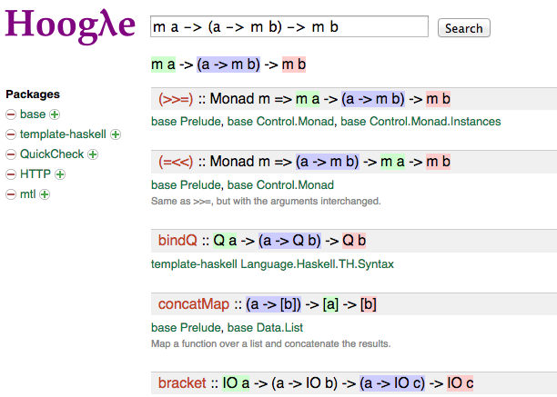

#OCaml◎Scope: a New OCaml API Search 


Jun Furuse - Standard Chartered Bank


# Who am I?

  

OCaml hacker using Haskell at work


# What did helped me most in Haskell industry?

* Type class?

* Purity?  

* Laziness?


# It's Hoogle.

API Search Engine for Haskell [Mitchell]




# API Search Engine

* By Name: [`? concat`](http://localhost:8080/?q=concat)
    * `List.concat`
    * `Array.concat`
    * `String.concat` ...

* By Type: [`? 'a t -> ('a -> 'b t) -> 'b t)`](http://localhost:8080/?q=%27a+t+-%3E+%28%27a+-%3E+%27b+t%29+-%3E+%27b+t)
    * `(>>=)`
    * `Core.Std.List.concat_map` ...

* Or Both: [`? val search : regexp -> _`](http://localhost:8080/?q=%3F+val+search+%3A+regexp+-%3E+_)
    * `Regexp.search : regexp -> string -> int -> (int * result) option`

Theoretical foundations: [Rittri], [Runciman], [Di Cosmo]


# Equivalent in OCaml? 

I use Hoogle 30 times a day sometimes.

* Does OCaml have something equivalent? There are, but limited:

    * OCamlBrowser

    * OCaml API Search

* So I built OCaml◎Scope


# OCamlBrowser

GUI Source browsing + API search: https://forge.ocamlcore.org/projects/labltk/

* Only for **locally compiled source**

* Uses OCaml typing code; it *is* OCaml badly:

    * Need to give `-I dir` and things can be shadowed:

            $ ls */*.cmi
            dir1/m.cmi     dir2/m.cmi
              
            $ ocamlbrowser -I dir1 -I dir2    # dir2/m.cmi is shadowed

    * `cmi`s are memory hungry

    * Search is too exact:

          `('a, 'b) t -> 'a -> 'b` does not find `Hashtbl.find`.

          Requires `('a, 'b) Hashtbl.t -> 'a -> 'b`
 


# OCaml API Search


* Remote search server 

* Search `stdlib`, `otherlibs` and `Extlib`

* Based on OCamlBrowser + CamlGI

    * Same characteristics with OCamlBrowser

* **Discontinued**


# Difficulties existed in OCaml


* `cmi` file is less informative (no location, no docs)

* `ml`/`mli` require proper options (`-I`, `-pp`, ...) to re-analyze

    ```shell
    ocamlfind ocamlc 
      -package spotlib,findlib,treeprint,orakuda,xml_conv,levenshtein
      -thread -I +ocamldoc -I .
      -syntax camlp4o -package meta_conv.syntax,orakuda.syntax,pa_ounit.syntax
      -c stat.ml
    ```

* No unified installation: hard to get these options

  configure / make / omake / ...


# They are now gone!

* `cmt`/`cmti` files gives you:

    * Compiled AST with locations

    * Contains arguments to re-process to run OCamlDoc

        `stat.cmt` ⇒
        
        ```shell
        ocamlfind ocamlc 
          -package spotlib,findlib,treeprint,orakuda,xml_conv,levenshtein
          -thread -I +ocamldoc -I .
          -syntax camlp4o -package meta_conv.syntax,orakuda.syntax,pa_ounit.syntax
          -c stat.ml
        ```

* OPAM unified installations

* compiler-libs: easier access to OCaml internals


# OCaml◎Scope: Hoogle for OCaml 

Ah, yes... mostly.

* Remote search server by Ocsigen/Eliom

* Edit distance based

* On memory DB


# Search by edit distance

Too exact search is not very useful:

* [`? finalize`](http://localhost:8080/?q=finalize)

    * `Gc.finalise`

* [`? val concat : string list -> string`](http://localhost:8080/?q=val+concat+%3A+string+list+-%3E+string)

    * `val concat : sep:string -> string list -> string`

Search done around 3 secs at worst so far in a small cheap VPS.


# On memory DB

Special Paths and Types with Hashconsing

Some numbers:

* Major 115 OPAM packages / 185 OCamlFind packages

* 525k entries (values, types, constructors...)

* 39Mb of the final data file

* 170Mb in Memory  (1/2 of naive `cmi` loading)


# OCaml specific challenges

* Scrapers have to deal with 2 package systems (OCamlFind and OPAM)

* Search result regrouping


# Scraping and 2 package systems

* Scraping `cmt`/`cmti`s per **OPAM** package

      `export OPAMKEEPBUILDDIR=yes`

* Module hierarchy by **OCamlFind** packages:

      `{batteries}.BatList.iter`

* Detect [OPAM ⇔ OCamlFind package relationships](http://localhost:8080/packages)


# Too many search results

OCaml specific problem:

## [`? (+)`](http://localhost:8080/?q=%28%2B%29&bad=on)

  +260

## [`? 'a t -> ('a -> 'b t) -> 'b t`](http://localhost:8080/?q=%27a+t+-%3E+%28%27a+-%3E+%27b+t%29+-%3E+%27b+t&bad=on)

  +500

## [`? map`](http://localhost:8080/?q=map&bad=on)

  +5000!


# Why so many?

* Things aliased by module aliases and inclusions

    * `module List = BatList`
    * `include Core_kernel.Std_kernel`

* No type class
    * Not `(>>=) :: Monad m => m a -> (a -> m b) -> m b`
    * But,
        * `Option.(>>=)`
        * `List.(>>=)`
        * `Lwt.(>>=)`
        *  ... 


# Workaround

* Grouping results by "short looks"

    * `Lwt.(>>=) : 'a Lwt.t -> ('a -> 'b Lwt.t) -> 'b Lwt.t)`

    * `    (>>=) : 'a     t -> ('a -> 'b     t) -> 'b     t)`

* Results

    * +500 ⇒ 8 groups: [`? 'a t -> ('a -> 'b t) -> 'b t`](http://localhost:8080/?q=%27a+t+-%3E+%28%27a+-%3E+%27b+t%29+-%3E+%27b+t)
    
      
    
    * +260 ⇒ 30 groups: [`? (+)`](http://localhost:8080/?q=%28%2B%29)
    
      
    
    * +5000 ⇒ 880 groups: [`? map`](http://localhost:8080/?q=map)
    
      


# Future work: Real alias analysis

One group, but with 69 results of [`? (+) : int -> int -> int`](http://localhost:8080/?q=%28%2B%29+%3A+int+-%3E+int+-%3E+int)

This should be improved like:

```
? (+) : int -> int -> int

Found 1 group of 1 result

{stdlib}.Pervasives.(+) : int -> int -> int
  with 63 aliases (see details) 
```

It would improve search performance too


# So many things to do!

* Better Web GUI
* Remote query API
* Repository of scraped data
* Better match: 
       ex. `snakeCase` should match with `snake_case`
* Bugs, bugs, bugs...


https://github.com/camlspotter/ocamloscope/issues


# OCaml◎Scope: a New OCaml API Search 

* API Search by Name and/or Types for OCaml
* Already searchable +100 top OPAM packages
* Any ideas, reports and contributions are welcome!

URL: http://ocamloscope.herokuapp.com
 
Source: https://github.com/camlspotter/ocamloscope


